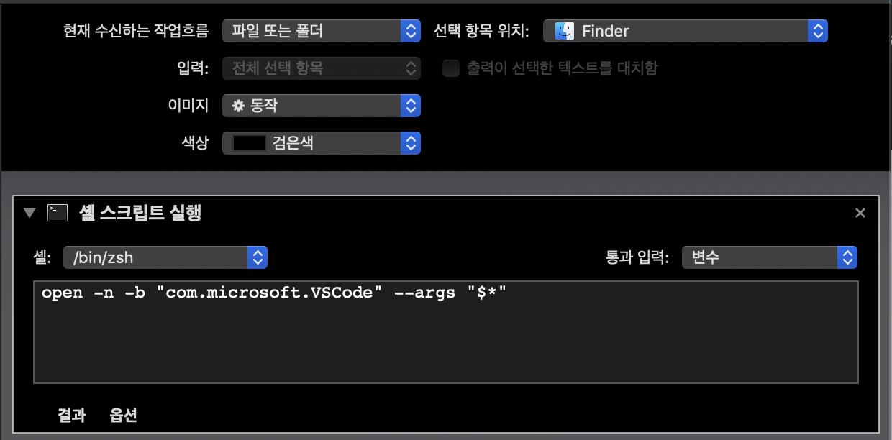

1. Automater를 실행
2. 파일 -> 신규 -> 서비스(Service)를 클릭
3. 현재 수신하는 작업흐름을 `파일 또는 폴더`로 변경하고 `선택 항목 위치`를 `Finder`로 변경
4. `쉘 스크립트 실행`을 추가
5. 통과 입력을 `변수`로 변경
6. 쉘스크립트 상자에 아래 와 같이 입력

```
open -n -b "com.microsoft.VSCode" --args "$*"
```

7. `VSCODE에서 실행` 등과 같이 입력하여 저장

---

아래를 참고하여 파일을 만들면 됩니다.

